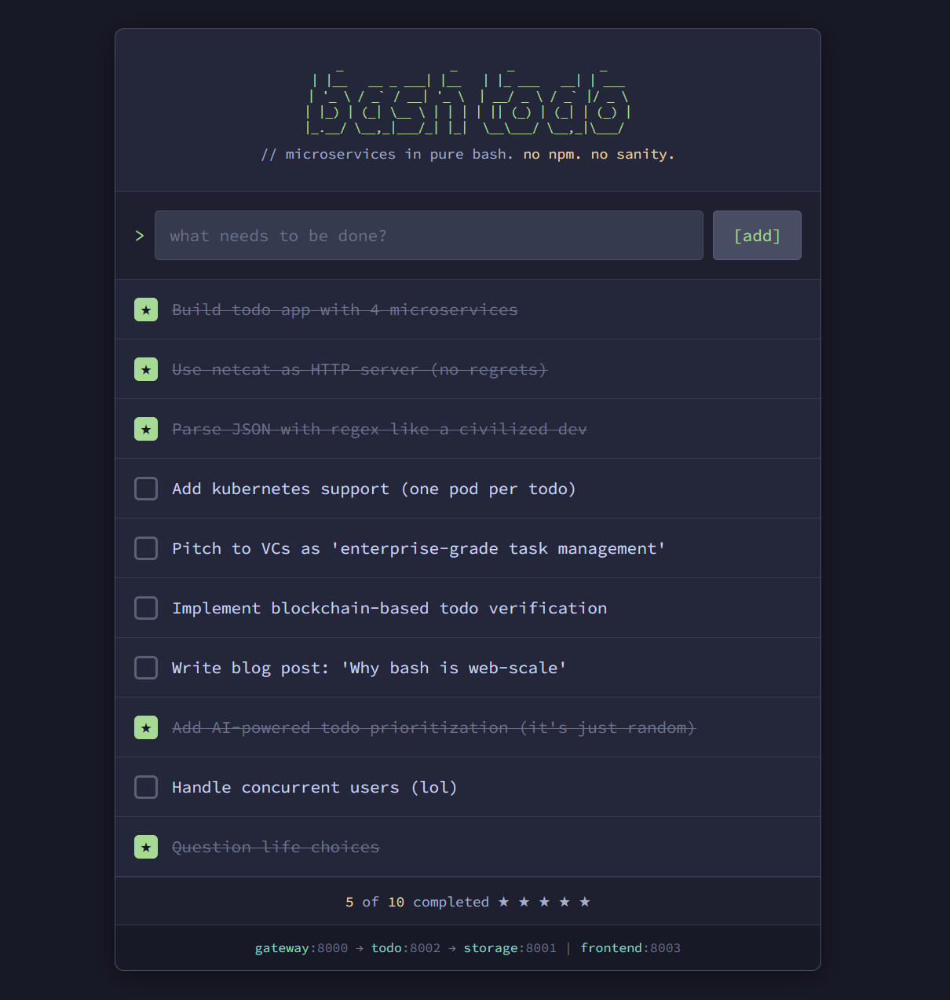

# vibe-todo

> Because the world needed another todo app. But in bash. With microservices.

## What is this?

This is a **fully-featured todo list application** built entirely in bash scripts using `netcat` as the HTTP server. Yes, you read that right. No Node.js. No Python. No frameworks. Just pure, unadulterated shell scripting and questionable life choices.

Someone asked an AI to vibe-code a todo app and it chose violence.



## Architecture

```
┌─────────┐     ┌─────────────────┐     ┌──────────────────┐     ┌─────────────────┐
│ Browser │────▶│ API Gateway:8000│────▶│ Todo Service:8002│────▶│Storage Svc:8001 │
└─────────┘     └─────────────────┘     └──────────────────┘     └─────────────────┘
                        │                        │                       │
                        ▼                        ▼                       ▼
                ┌─────────────────┐     ┌────────────────┐       ┌─────────────┐
                │Frontend Svc:8003│     │ Bashis:6379    │       │ todos.json  │
                └─────────────────┘     └────────────────┘       └─────────────┘
                        │
                        ▼
                ┌─────────────────┐
                │ LLM Svc:8004    │  ← A transformer. In bash. Yes, really.
                └─────────────────┘
```

Six microservices. For a todo list. One of them is a neural network. Running on netcat. Because obviously.

### Bashis: A Redis Clone in Bash

We would've called it **Redish™** but Redis didn't grant us that. So instead, meet **Bashis** - a Redis-compatible key-value cache server written entirely in bash. It speaks actual RESP protocol and works with real `redis-cli`. Because writing our own caching layer was easier than adding a dependency.

### LLM Service: A Transformer in Bash

We implemented a GPT-style transformer from scratch. In bash. With fixed-point arithmetic and Taylor series approximations for activation functions. It generates text at approximately 0.07 tokens per second (14 seconds per token). This is not a typo. This is art.

**What it does:**
- Full transformer architecture (embeddings, attention, FFN, layer norm)
- Trained on Shakespeare (or whatever text you provide)
- Generates text that is... creative
- Takes about 4 minutes to generate 5 tokens

**What we might use it for:**
- We genuinely don't know yet
- Maybe AI-powered todo suggestions?
- Maybe it just sits there, generating Shakespeare
- The point is it exists

**Does it work?**
- Sometimes. The math is correct (verified against PyTorch)
- The output quality depends on your patience for training
- It will definitely generate *something*

See [llm-architecture.md](llm-architecture.md) for the full technical deep-dive.

## Features

- Add todos (revolutionary)
- Mark todos as complete (groundbreaking)
- Delete todos (disruptive innovation)
- A beautiful purple gradient UI (the only thing that makes sense here)
- **Redis-compatible caching layer** written in bash (Bashis) - works with actual `redis-cli`
- **LLM inference engine** written in bash - a GPT-style transformer that runs at geological speeds
- File locking with `flock` because race conditions in your bash todo app would be embarrassing
- JSON parsing with `sed` and `grep` because who needs `jq`
- Matrix multiplication in bash arrays because linear algebra doesn't require C

## Prerequisites

- Bash (the only dependency that matters)
- `nc` (netcat) - your enterprise-grade HTTP server
- Docker (optional, for running in containers without Dockerfiles)
- A complete disregard for conventional software engineering practices
- The audacity

## Running

Start the microservices empire:
```bash
cd todo-microservices
./start.sh
```

Visit `http://localhost:8000` and witness the glory.

## Running with Docker

For those who want containers but refuse to write Dockerfiles:

```bash
./docker-build.sh           # Build images using docker create/commit (no Dockerfiles)
./docker-compose.sh up -d   # Start the stack (YAML not invited)
./docker-compose.sh ps      # Admire your orchestration
./docker-compose.sh down    # Tear it all down
```

Your Docker Desktop won't suspect a thing - it sees a respectable compose project.

## Stopping

```bash
./stop.sh
```

This kills the dream (and processes on ports 8000-8004 and 6379).

## Testing

```bash
./test.sh
```

Yes, there are tests. We're not *complete* animals.

## Technical Highlights

- **HTTP/1.1 implementation from scratch** - because importing an HTTP library is for the weak
- **RESP protocol implementation** - Bashis speaks Redis wire protocol, tested with real `redis-cli`
- **GPT-style transformer in bash** - with fixed-point math, Taylor series, and Newton's method
- **Bash coprocesses** - bet you didn't know bash could do that
- **Proper CORS headers** - we're chaotic, not incompetent
- **JSON manipulation with regex** - just as God intended
- **Service-to-service communication** - over HTTP, via netcat, in bash, on localhost
- **Caching with associative arrays** - `declare -A` is basically Redis if you squint
- **Matrix multiplication in nested loops** - O(n³) and proud of it
- **Softmax via Taylor series** - because importing numpy is cheating

## FAQ

**Q: Why?**
A: Why not?

**Q: Should I use this in production?**
A: Absolutely. Scale it to millions of users. What could go wrong?

**Q: Is this a joke?**
A: This is art.

**Q: How do I add authentication?**
A: Write another bash script. That's how we solve all problems here.

**Q: My company wants to adopt this. What's the enterprise licensing?**
A: Please seek professional help.

## Contributing

If you want to add more microservices to this todo app, you might be exactly the kind of person we're looking for. Or avoiding. We're not sure yet.

## License

MIT - because even chaos deserves freedom.

---

*Built with vibes, netcat, and an AI that was asked to "just make a todo app" and dramatically misunderstood the assignment.*
